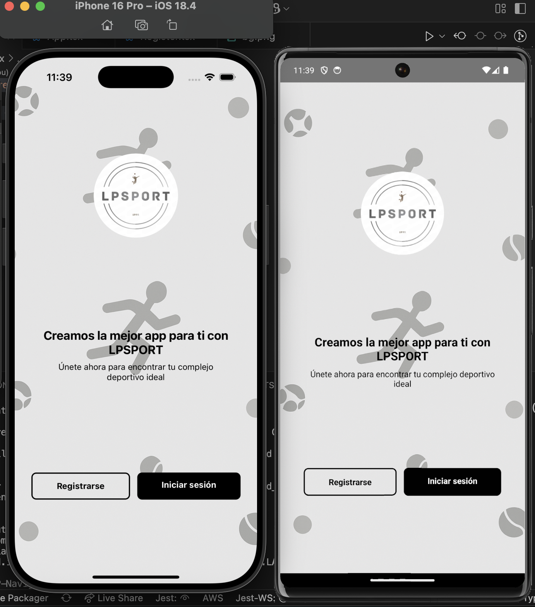

# LPSPORT

LPSPORT es una aplicación móvil deportiva desarrollada en **React Native CLI** con **Firebase** y **Zustand**, pensada para facilitar la búsqueda de partidos, complejos deportivos y recomendaciones personalizadas según el nivel del usuario.

---

## 🚀 Tecnologías utilizadas

- **React Native CLI**
- **TypeScript**
- **Firebase Authentication**
- **AsyncStorage** (persistencia local)
- **Zustand** (gestión global de estado)
- **react-hook-form** + **Yup** (formularios y validaciones)
- **React Navigation** (navegación entre pantallas)

---

## 📆 Funcionalidades principales

### 1. Registro e inicio de sesión
- Formulario de registro con datos opcionales.
- Autenticación con Firebase.
- Acceso como **invitado**.

### 2. Perfil
- Visualización y edición de datos personales.
- Barra de progreso con animación según porcentaje de perfil completado.
- Vista distinta para usuarios invitados.

### 3. Home
- Header personalizado con ciudad y logo.
- Buscador con sugerencias en tiempo real (search suggestions).
- Secciones de partidos:
  - Disponibles
  - Recomendados por nivel
  - Complejos deportivos (vista resumen)

### 4. Pantalla de complejos deportivos
- Lista de complejos con ciudad y distancia.
- Buscador por nombre o ciudad.
- Marcar favoritos.
- Apartar canchas (simulado).
- Toasts personalizados para cada acción.

### 5. Búsqueda de partidos
- Filtrado por ciudad y nivel.
- Tarjetas con ranking mínimo y jugadores actuales.
- Botón de "Unirse" (simulado).

### 6. Matchmaking
- Partidos sugeridos según el nivel del jugador.
- Filtros por nivel automáticos.

### 7. Persistencia local
- Perfil y favoritos guardados en AsyncStorage.
- Datos sincronizados tras login.

---

## 🚀 Cómo iniciar el proyecto

1. Clona el repositorio:

```bash
git clone <url-del-repo>
cd lpsport
```

2. Instala las dependencias:

```bash
yarn install
```

3. Ejecuta el proyecto en Android:

```bash
yarn android
```

> Asegúrate de tener un emulador abierto o un dispositivo conectado por USB.

4. Si es la primera vez, también corre:

```bash
cd android && ./gradlew clean
```

---

## 🔧 Instalación

```bash
npm install
cd android
./gradlew clean
./gradlew assembleRelease
```

## 📱 Capturas de pantalla
> Puedes agregar aquí tus capturas con:
```



```

---

## 🚫 Por hacer / Futuras mejoras
- Analytics. 
- Notificaciones push.
- Animaciones más avanzadas.

---

### 📋 Tablero de tareas y mejoras

Puedes seguir el progreso del proyecto, ideas y pendientes en el tablero de Trello:

🔗 [Trello - LPSPORT](https://trello.com/b/r5tOyV08/lpsport)

---

## 📢 Crédito
Desarrollado por **Lilia Padilla**.
